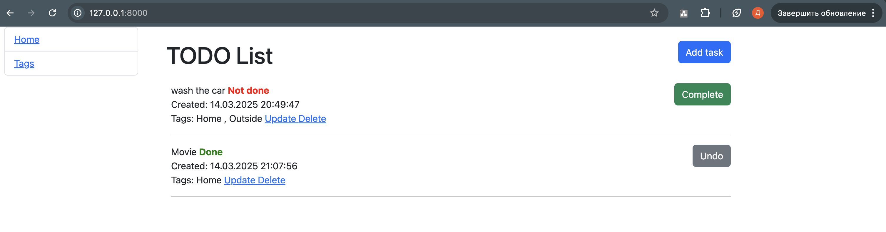

# todo-list

Django project for managing tasks in todo list.

## Installation

Python3 must be already installed

git clone https://github.com/dimakherson74/todo-list.git
cd todo-list
python 3 -m venv venv
source venv/bin/activate
pip install -r requirement.txt
python manage.py runserver

## Features

The project includes the ability to create tasks with information about their status (done or not dote), as well as the ability to update and delete tasks.

## Demo

